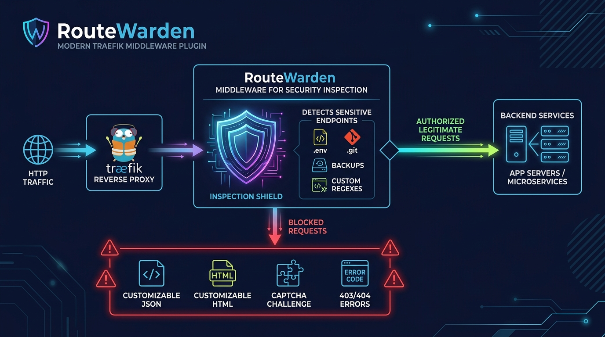

<div align="center">
  
  <h1>RouteWarden</h1>
  <p><strong>Advanced Traefik Middleware Plugin for Sensitive Route & Endpoint Protection</strong></p>
</div>

<p align="center">
  <a href="https://github.com/aman400/routewarden/releases"></a>
  <a href="https://pkg.go.dev/github.com/aman400/routewarden"></a>
  <a href="LICENSE"></a>
  <a href="https://goreportcard.com/report/github.com/aman400/routewarden"></a>
</p>

**RouteWarden** is a high-performance Traefik middleware plugin designed to protect applications by blocking sensitive files, backup artifacts, and unauthorized endpoints. When a match occurs, RouteWarden can return **custom JSON, custom HTML, an interactive Captcha challenge (Cloudflare Turnstile, hCaptcha, Google reCAPTCHA), a redirect, or custom status codes & headers**.

Repository: [https://github.com/aman400/routewarden](https://github.com/aman400/routewarden)

---

## Key Features

- 🛡️ **Built-in Sensitive Patterns**: Out-of-the-box blocking for `.env*`, `.git`, `.aws`, `.ssh`, backups (`.bak`, `.backup`, `.sql`, `.tar.gz`, `.zip`), configs (`.conf`, `.config`, `.ini`, `.yaml`), logs (`.log`), and debug endpoints (`/phpinfo.php`, `/actuator/*`).
- 🎯 **Custom Path Regex**: Configure any custom regex pattern under `pathPatterns` or `blockPatterns` (e.g. `(?i)(^|/)(\.env.*|.*\.(txt|log|bak|backup|sql|conf|config|ini|yaml|yml))` or `^/admin/(secret|internal)`).
- 🧩 **Multiple Response Modes**:
  - **`json`**: Return formatted JSON response with custom status code and `application/json` Content-Type.
  - **`html`**: Return branded HTML error/warning pages with custom status code and `text/html`.
  - **`captcha`**: Present a modern, responsive Captcha challenge using **Cloudflare Turnstile**, **hCaptcha**, **Google reCAPTCHA**, or custom templates.
  - **`redirect`**: Send attackers or unauthorized requests to a honeypot or login URL.
  - **`text`**: Standard text responses.
- ⚙️ **Custom Status Codes & Headers**: Customize HTTP status codes (e.g., 401, 403, 404, 429, 418) and response headers (e.g., `Retry-After`, `X-Protected-By`).
- 🌐 **IP / Subnet Whitelist**: Exempt trusted administrator or internal IPs/CIDRs (e.g., `192.168.1.50`, `10.0.0.0/8`, `2001:db8::/32`) from blocking, supporting `X-Forwarded-For`, `X-Real-IP`, and direct socket addresses.
- 🟢 **Allowlist Support**: Whitelist legitimate endpoints (e.g., `/robots.txt`, `/ads.txt`, `/.well-known/*`).
- ⚡ **Anti-Evasion Engine**:
  - Multi-layer iterative URL unescaping (`%252e%252e` / `%252eenv`).
  - Semicolon matrix parameter handling (`/;param/.env`, `/endpoint;jsessionid=.../.env`).
  - Windows/IIS backslash normalization (`/static\..\.env`).
  - Encoded null byte protection (`%00`).

---

### Built-in Default Block Rules

When `enableDefaultPatterns: true` (default), RouteWarden intercepts:

| Category | Targeted Patterns & Extensions |
|---|---|
| **Environment & Configs** | `.env`, `.env.*`, `*.conf`, `*.config`, `*.ini`, `*.yaml`, `*.yml` |
| **Backups & Database Dumps** | `*.bak`, `*.backup`, `*.sql`, `*.dump`, `*.sqlite`, `*.db` |
| **Compressed Archives** | `*.tar`, `*.tar.gz`, `*.tgz`, `*.zip`, `*.rar`, `*.7z`, `*.gz`, `*.bz2` |
| **Version Control & Cloud** | `/.git/*`, `/.svn/*`, `/.hg/*`, `/.aws/*`, `/.ssh/*`, `/.kube/*`, `/.docker/*` |
| **Debug & Server Info** | `phpinfo.php`, `info.php`, `server-status`, `server-info`, `/actuator/*`, `/metrics`, `/heapdump` |
| **Package & Lock Files** | `package-lock.json`, `yarn.lock`, `pnpm-lock.yaml`, `composer.lock`, `Pipfile.lock`, `requirements.txt` |
| **Logs & Text Artifacts** | `*.log`, `*.txt` *(with safe default allows for `/robots.txt`, `/ads.txt`, `/security.txt`)* |

---

## Architecture

<p align="center">
  
</p>

---

## Configuration Reference

### Global Plugin Options

| Option | Type | Default | Description |
|---|---|---|---|
| `enabled` | `bool` | `true` | Enable or disable the plugin. |
| `enableDefaultPatterns` | `bool` | `true` | Enable built-in sensitive endpoint patterns. |
| `pathPatterns` | `[]string` | `[]` | List of custom path regular expressions to block. |
| `blockPatterns` | `[]string` | `[]` | Synonym for `pathPatterns`. |
| `allowPatterns` | `[]string` | `[robots.txt, ads.txt, security.txt, .well-known/*]` | Regular expressions to allow, overriding any block pattern. |
| `allowedIps` | `[]string` | `[]` | Whitelist of client IPs or CIDR subnets exempt from all blocking (e.g., `127.0.0.1`, `10.0.0.0/8`). |
| `silentDrop` | `bool` | `false` | Close TCP connection immediately with no headers. |
| `checkQuery` | `bool` | `false` | Also inspect query parameters for sensitive patterns. |
| `response` | `object` | *(see below)* | Detailed response behavior configuration. |

### `response` Object Reference

| Field | Type | Default | Description |
|---|---|---|---|
| `mode` | `string` | `"text"` | Response type: `"text"`, `"json"`, `"html"`, `"captcha"`, or `"redirect"`. |
| `statusCode` | `int` | `403` | HTTP status code to return (e.g., `401`, `403`, `404`, `429`). |
| `contentType` | `string` | *(auto)* | Override Content-Type header. |
| `body` | `string` | `""` | Custom payload string (raw JSON, HTML string, or text). |
| `headers` | `map[string]string` | `{}` | Custom response headers to inject. |
| `redirectUrl` | `string` | `""` | Destination URL if `mode` is `"redirect"`. |
| `captcha` | `object` | *(see below)* | Captcha settings if `mode` is `"captcha"`. |

### `response.captcha` Object Reference

| Field | Type | Default | Description |
|---|---|---|---|
| `provider` | `string` | `"turnstile"` | Captcha provider: `"turnstile"`, `"hcaptcha"`, `"recaptcha"`, or `"custom"`. |
| `siteKey` | `string` | `""` | Public site key for Turnstile/hCaptcha/reCAPTCHA. |
| `title` | `string` | `"Security Check Required"` | Heading title displayed on the challenge page. |
| `template` | `string` | `""` | Optional custom HTML template string. |

---

## Installation & Traefik Setup

### 1. Static Configuration (`traefik.yml`)

Declare the plugin in Traefik's experimental plugins section:

```yaml
experimental:
  plugins:
    routewarden:
      moduleName: github.com/aman400/routewarden
      version: v0.2.0
```

For **local development**:
```yaml
experimental:
  localPlugins:
    routewarden:
      moduleName: github.com/aman400/routewarden
```

---

### 2. Dynamic Configuration (`dynamic_conf.yml`)

#### Example A: Sensitive File Blocker with JSON Response
```yaml
http:
  middlewares:
    secure-routes:
      plugin:
        routewarden:
          enabled: true
          enableDefaultPatterns: true
          pathPatterns:
            - '(?i)(^|/)(\.env.*|.*\.(txt|log|bak|backup|sql|conf|config|ini|yaml|yml))'
            - '(?i)^/api/(internal|admin|debug)(/.*)?$'
          allowPatterns:
            - '(?i)^/robots\.txt$'
            - '(?i)^/ads\.txt$'
            - '(?i)^/\.well-known(/.*)?$'
          allowedIps:
            - '127.0.0.1'
            - '10.0.0.0/8'
            - '192.168.1.100'
          response:
            mode: json
            statusCode: 403
            body: '{"error":"Forbidden","message":"Access to sensitive endpoint is blocked","status":403}'
            headers:
              X-Protected-By: "RouteWarden"

  routers:
    app-router:
      rule: "Host(`example.com`)"
      service: "app-service"
      middlewares:
        - secure-routes
```

#### Example B: Captcha Challenge (Cloudflare Turnstile)
```yaml
http:
  middlewares:
    login-captcha:
      plugin:
        routewarden:
          enabled: true
          pathPatterns:
            - '(?i)^/admin/.*'
            - '(?i)^/wp-login\.php'
          response:
            mode: captcha
            statusCode: 403
            captcha:
              provider: "turnstile"
              siteKey: "0x4AAAAAAxxxxxxxxxxxxxx"
              title: "Security Verification Required"
```

#### Example C: Branded Custom HTML 404
```yaml
http:
  middlewares:
    custom-404:
      plugin:
        routewarden:
          enabled: true
          enableDefaultPatterns: true
          response:
            mode: html
            statusCode: 404
            body: |
              <!DOCTYPE html>
              <html lang="en">
              <head><meta charset="utf-8"><title>Not Found</title></head>
              <body style="font-family:sans-serif;text-align:center;padding:50px;">
                <h1>404 - Not Found</h1>
                <p>The requested resource could not be found.</p>
              </body>
              </html>
```

#### Example D: Redirect to Honeypot or Warning Page
```yaml
http:
  middlewares:
    honeypot-redirect:
      plugin:
        routewarden:
          enabled: true
          pathPatterns:
            - '(?i).*\.(php|asp|aspx|cgi)$'
          response:
            mode: redirect
            statusCode: 302
            redirectUrl: "https://example.com/security-warning"
```

---

### 3. Docker Compose Labels Example

```yaml
services:
  web:
    image: my-web-app:latest
    labels:
      - "traefik.enable=true"
      - "traefik.http.routers.web.rule=Host(`example.com`)"
      - "traefik.http.routers.web.middlewares=warden"
      - "traefik.http.middlewares.warden.plugin.routewarden.enabled=true"
      - "traefik.http.middlewares.warden.plugin.routewarden.response.mode=json"
      - "traefik.http.middlewares.warden.plugin.routewarden.response.statusCode=403"
      - "traefik.http.middlewares.warden.plugin.routewarden.response.body={\"error\":\"access_denied\"}"
```

---

### 4. Kubernetes IngressRoute (Traefik CRD)

```yaml
apiVersion: traefik.io/v1alpha1
kind: Middleware
metadata:
  name: routewarden-middleware
  namespace: default
spec:
  plugin:
    routewarden:
      enabled: true
      enableDefaultPatterns: true
      statusCode: 403
---
apiVersion: traefik.io/v1alpha1
kind: IngressRoute
metadata:
  name: my-ingress
spec:
  entryPoints:
    - websecure
  routes:
    - match: Host(`example.com`)
      kind: Rule
      services:
        - name: my-service
          port: 80
      middlewares:
        - name: routewarden-middleware
```

## Development & Testing

RouteWarden includes a comprehensive, modular test suite with isolated unit tests and end-to-end middleware pipeline integration tests.

### Run All Tests with Race Detector

```bash
go test -v -race ./...
```

### Run Tests with Statement Coverage

```bash
go test -cover ./...
```

### Test Suite Architecture

| Test File | Focus Area |
|---|---|
| `config_test.go` | Default settings, regex dictionaries, and configuration factory. |
| `path_normalizer_test.go` | Multi-layer URL decoding, semicolon matrix parameters, Windows backslash normalization, and null byte evasion vectors. |
| `ip_filter_test.go` | IPv4/IPv6 exact match, CIDR subnet evaluation, `X-Forwarded-For`, `X-Real-IP`, and invalid input errors. |
| `response_handler_test.go` | Custom JSON, HTML, Turnstile/hCaptcha/reCAPTCHA templates, redirects, silent drops, and status codes. |
| `routewarden_test.go` | Middleware integration, default patterns, custom regex rules, allowlist overrides, and query inspection. |
| `integration_test.go` | Full multi-middleware pipeline simulation (Tracing ➡️ RouteWarden ➡️ Backend Service). |

---

## License

This project is licensed under the [MIT License](LICENSE).
